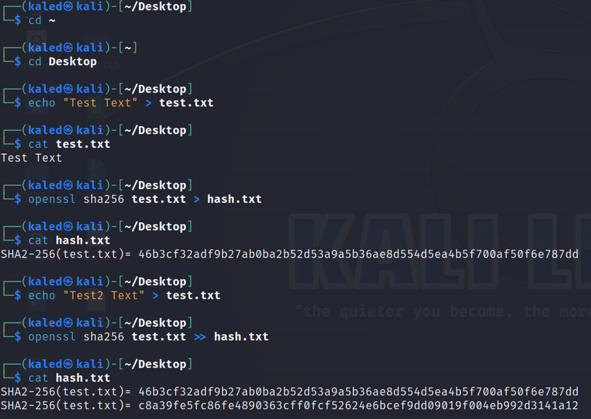
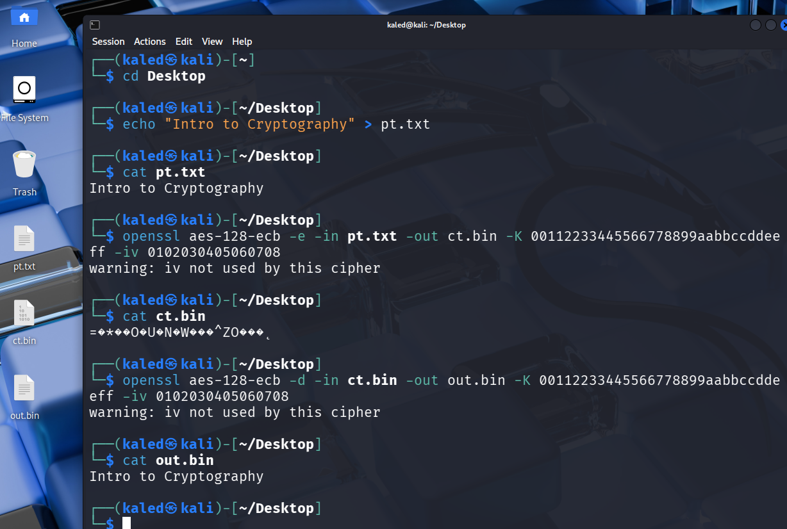
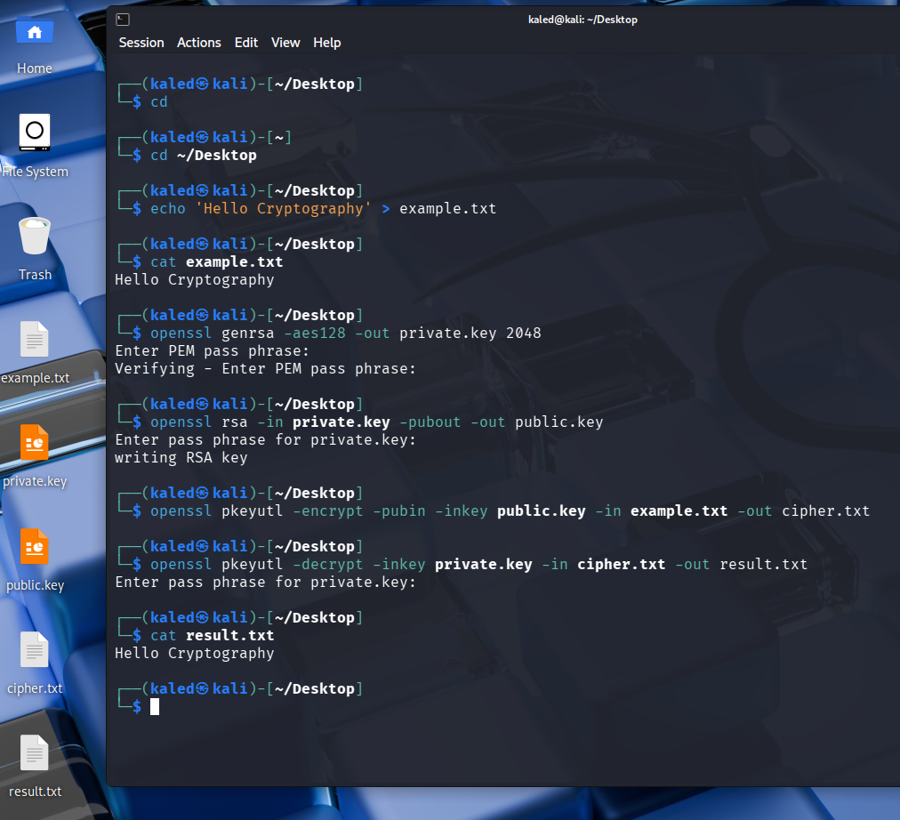
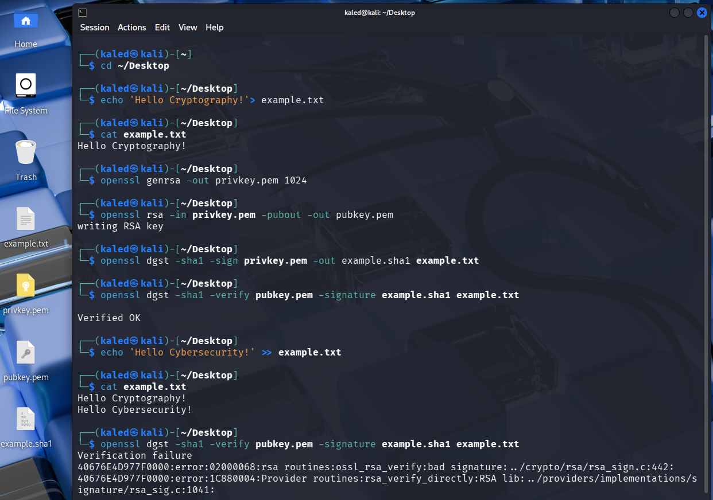

# Cryptography basic activities

- Test the activities below in Kali Linux.
- This lesson is an introductory lab based on examples.
- The goal is to help students observe how cryptography works in practice before the theory is explained in class.
- Students are expected to run the commands, observe the output, and answer the related discussion questions during the lesson.

## Activity 1: Hashing example


## Activity 2: AES Symmetric Encryption
```bash
# Move to the Desktop if preferred
cd ~/Desktop
# Create test input file pt.txt
echo "Intro to Cryptography" > pt.txt
# Read the created file
cat pt.txt 
# Encrypt using AES algorithm (What is -iv value?):
# ecb in aes-128-ecb is not secure enough, you may try with cbc 
openssl aes-128-ecb -e -in pt.txt -out ct.bin -K 00112233445566778899aabbccddeeff -iv 0102030405060708
# Read the output file ct.bin
# Notice that cat is not suitable encrypted bin file, you can use xxd
cat ct.bin
# Decrypt using the same AES algorithm and key:
openssl aes-128-ecb -d -in ct.bin -out out.bin -K 00112233445566778899aabbccddeeff -iv 0102030405060708 
```


## Activity 3: RSA Asymmetric Encryption
```bash
# Move to the Desktop if preferred
cd ~/Desktop
# Create the file
echo 'Hello Cryptography' > example.txt
# Read the file
cat example.txt
# Generate private key, enter passphrase to protect the private key
openssl genrsa -aes128 -out private.key 2048
# Generate public key from private key, use the private key passphrase
openssl rsa -in private.key -pubout -out public.key
# Encrypt using pkeyutl
openssl pkeyutl -encrypt -pubin -inkey public.key -in example.txt -out cipher.txt
# Decrypt using pkeyutl, use the private key passphrase
openssl pkeyutl -decrypt -inkey private.key -in cipher.txt -out result.txt
# Read the result file
cat result.txt
```



## Activity 4: RSA Digital Signature

Note: this activity uses simple introductory settings for teaching purposes. Stronger modern choices and recommended best practices will be explained later in the course, like avoid `sh1` algorithm and `1024` key size.

```bash
# Move to the Desktop if preferred
cd ~/Desktop
# Create test input file example.txt
echo 'Hello Cryptography!'> example.txt
# Read the file
cat example.txt
# Generate private key
openssl genrsa -out privkey.pem 1024
# Generate public key from private key
openssl rsa -in privkey.pem -pubout -out pubkey.pem
# Generate the signature example.sha1
openssl dgst -sha1 -sign privkey.pem -out example.sha1 example.txt
# Verify the signature based on the file content & signature value
openssl dgst -sha1 -verify pubkey.pem -signature example.sha1 example.txt
# Change the the file content
echo 'Hello Cybersecurity!' >> example.txt
# Read the updated file
cat example.txt
# Verify the signature based on the file updated content & same previous signature value
openssl dgst -sha1 -verify pubkey.pem -signature example.sha1 example.txt
```




Reference:
- https://docs.openssl.org
